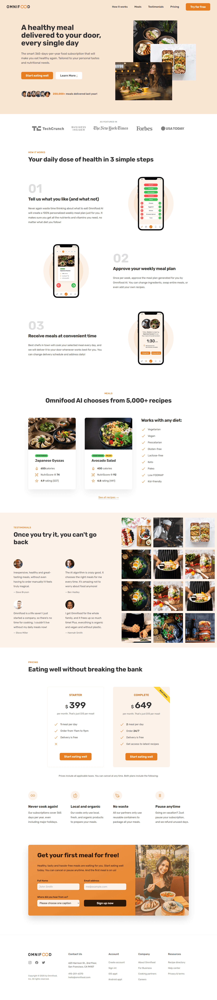

# Omnifood

A responsive landing page for a fictional healthy meal delivery service, built as part of a web development course to practice real-world HTML, CSS, and responsive design skills. This project helped me strengthen my understanding of layout structuring, Flexbox, Grid, and clean UI design principles.

---

## About This Project

This project is a fully responsive HTML and CSS-based landing page, built as part of a web development course to practice real-world layout techniques, design principles, and responsive behavior.

It was a great learning experience to understand how to:
- Structure semantic HTML
- Use CSS Flexbox and Grid for layout
- Create responsive designs for mobile and desktop
- Build clean, modern user interfaces

---

## Features

- Hero section with CTA buttons and images
- 3-step working process section
- User testimonials with images
- Transparent pricing section
- Email sign-up form
- Mobile-responsive layout
- Clean and consistent design

---

## Technologies Used

- HTML5
- CSS3
- JavaScript
- Responsive design techniques

---

## Preview

---

## Live Demo

[Click here to view the live site](https://geet-omnifood.netlify.app/)

---

## Lessons Learned

- Semantic HTML structure
- Responsive layout techniques (media queries, Flexbox, Grid)
- Consistent design system
- Effective call-to-action and UX principles

---

## Author

Made by Geetika  
Connect with me on [LinkedIn](https://www.linkedin.com/in/geetika-maurya-40083725b/)

---

## Deployment

This project was deployed using [Netlify](https://app.netlify.com/), providing fast and reliable hosting for sites.

---

## License

This project is for **learning purposes only**. All design credits go to the original course/instructor.
